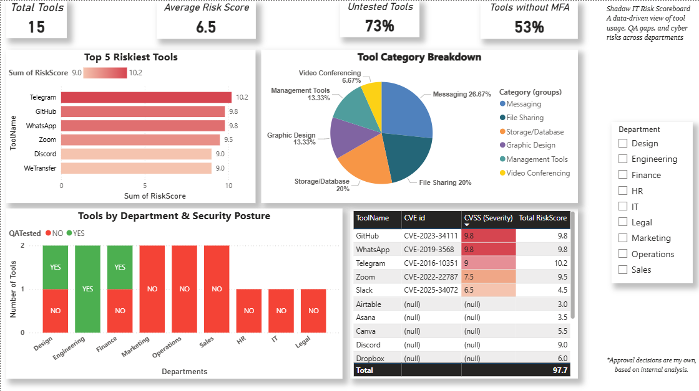

# 🔍 Shadow IT Detection & Risk Intelligence Dashboard
**Author**: Asher Livingston  
**Program**: M.S. Cybersecurity & Networks – University of New Haven  
**Created**: July 2025

## 📌 Overview

This Power BI dashboard analyzes the use of unauthorized software tools (Shadow IT) across departments to identify potential cybersecurity risks. The project focuses on tools lacking MFA, QA testing, or associated with critical CVEs (Common Vulnerabilities and Exposures).

## 🎯 Key Goals

- Detect unapproved software tools
- Visualize department-wise risk exposure
- Assess security controls like MFA & QA testing
- Highlight CVE exposure and suggest safe corporate alternatives

## 📊 Features

- **KPI Cards**: Total tools, average risk, % without MFA
- **Stacked Bar & Pie Charts**: Tools by department, QA status, approval
- **CVE Risk Table**: Includes CVE ID, CVSS score, and exploit summary
- **Interactive Filters**: Slicers for department, MFA status, etc.

## 🛠️ Tech Stack

- Power BI Desktop v2.145.1105.0
- DAX (Data Analysis Expressions)
- Manually curated CSV dataset
- Cybersecurity knowledge for labeling tool risk

## 📁 Project Files

- `ShadowIT risk scoreboard.csv`(Dataset/ShadowIT risk scoreboard.csv)
- `Shadow IT Detection & Risk Intelligence Report.pdf`(Reports/Shadow IT Detection & Risk Intelligence Report.pdf)
- `Shadow IT Detection & Risk Intelligence Documentation.pdf`(Reports/Shadow IT Detection & Risk Intelligence Documentation.pdf)
- `dashboard.png`

## 📸 Screenshots

## 🔐 Dataset Columns 

| Column       | Description                                 |
|--------------|---------------------------------------------|
| ToolName     | Name of the Shadow IT tool                  |
| Department   | Using department                            |
| RiskScore    | Overall risk score (0–10 scale)             |
| MFAEnabled   | Whether MFA is implemented (Yes/No)         |
| QA_Tested    | Whether QA testing was performed (Yes/No)   |
| Approved     | Final approval status                       |
| CVE_ID       | Related CVE (if any)                        |
| CVSS_Score   | CVE severity rating (0–10 scale)            |

## 📌 Insights & Recommendations

- Over 60% of tools lacked QA testing  
- High-risk messaging apps (e.g., Telegram, Discord) used in multiple teams  
- Recommend replacing with corporate-approved secure alternatives

| Folder        | Contents                                  |
|---------------|-------------------------------------------|
| `Dataset/`    | Final CSV used in Power BI                |
| `Reports/`    | Documentation and formal report PDFs      |
| `Screenshot/` | Dashboard visuals                         |
| `pbix file/`  | Power BI source file                      |

## 📃 License

This project is licensed under the [MIT License](./LICENSE).

## 💬 Contact

Feel free to connect:

- 💼 [LinkedIn](https://www.linkedin.com/in/asher-livingston-1a3676213/)  
- 📧 Email: asherlivingston02@gmail.com

---
